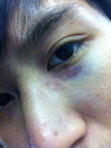

First of all. Yes that is a ceiling fan hanging by a hanger on a light bulb. That's a mistake waiting to happen, and no that's not what I'm condoning on this post. This was in a hostel and the  guy needed to be hanged himself for constructing such a monstrosity.

Mistakes, rejection, unfortunate events; they allow to you to learn, to grow. They allow you to prepare for the worst and improve who you are. It puts  yourself out there, dropping you  into the unknown where you've never been before. People that don't make mistakes, they're not enduring hardship. They doing things that are too comfortable, too easy that they can do it perfectly without making mistakes.

Mistakes is how we grow. And over the last few days I've experienced a lot of hardship and depressing things. Rather than feel depressed or sad about these things, you should use them to fuel progress in your own life.

So the first thing that happened over this weekend is that I came back from clubbing and I lost my keys. I ended up sleeping for 3 hours outside my hostel on marble floor. This is a mistake I made that is really only common sense, but I'll learn to keep my personal things safer so I don't have to deal with these kinds of consequences.

I got rejected. Rejection is a part of life. No one likes to be rejected for anything, whether it's girls, jobs, or not making the school sports team. Rejection is important to learn quickly, to learn to be numb to it, because the more things you try and do, the more you will be rejected. If you learn to be unaffected by it, you can move with confidence in all things you do. You can go after the one you want, or the things you want with pride and passion rather than with fear. Because fear causes mistakes, it causes miscalculations. It makes you stutter, literally and metaphorically. It is something primal to alert us to danger, but for modern day interactions it can hold us back. When it is related to being rejected from your 1st choice university, job or girl, it is something that is unnecessary. Because the consequences of such an event is purely emotional and is the majority of the time is inconsequential to you life. It causes us as emotional beings to act sub par to our potential. When you want to do something, when you like something, when you get that feeling of joy, you need to grab it, no matter how scared you are. Period. And if you fail, move on.

Oh yeah, and I got punched in the face. Not sure if I learnt anything from that. Maybe dodge a little earlier and be less inhibited by alcohol. It's been a long weekend...

Life is short, and it's too short to be scared.