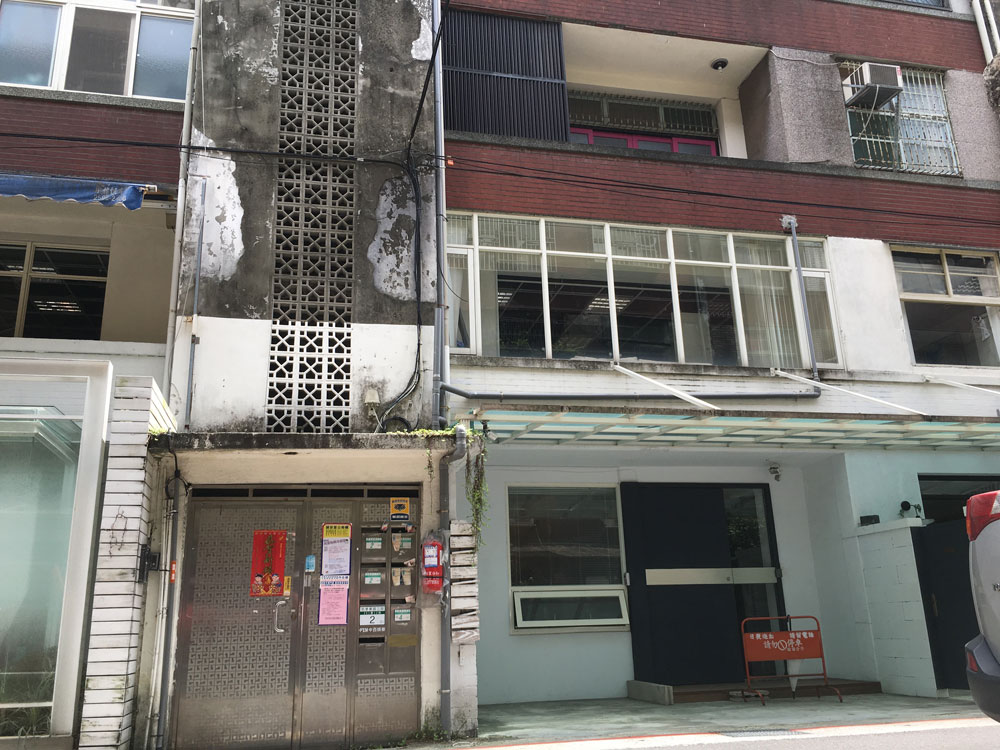
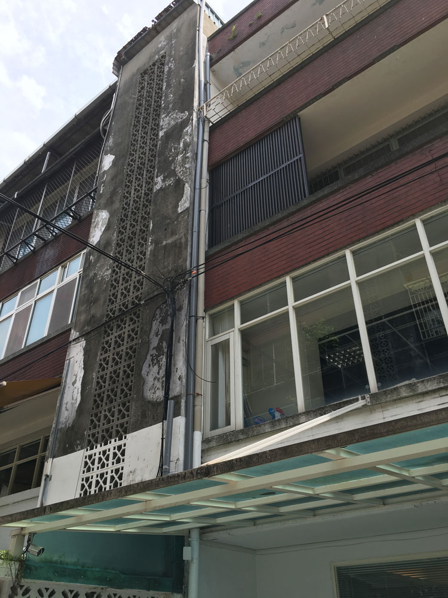

Last week I had dinner with my friend. We had a great chat, went to have coffee after and I go home thinking all is well. I get back to my place and I go through my left trouser pocket, expecting to find my keys. A feeling of dread flows through my body as my hand comes up empty hand. The right pocket, the back right pocket, the back left pocket. Nothing. I check my bag, once, twice. Nothing. Frantic now, I call my roommates, they're both out of town. Shit.

My place is on the second floor, and we never lock the balcony. My last gambit. I'm going to climb into my flat. Isn't it for reasons like this I've learnt to climb? The first floor is easy to get up to. I jump up and grab the roof of the platform that forms the bottom of the first floor. I pull myself up with relative ease and now I'm on the first floor landing. Just one more floor to go. But here's where it gets tricky. The path to my flat is either up a relatively easy stone wall that forms the stairwell of my building. I'd love to use that route, there are big hand holds that form almost ladder-like structure all the way up to the top of the building. But it's far off to the left, and it's difficult or impossible to get to the balcony from there. The other option is the water pipes. Three hard plastic pipes lashed together with cable ties. The climb looks harder, the pipes are slippery and larger than my hand can grip. Its only saving grace is it leads directly to the bottom of my balcony. If I can get to there, it's definitely possible. 

The last obstacle to salvation is my actual balcony. The entire left side is covered by a corrugated iron fence, meaning I'll need to traverse to middle of the balcony just holding onto the stone railing, before I can climb up and over. There doesn't look like there's any footholds, so it's going to have to be all arms.

I decide climbing the pipes is the only option. The easier route on the left is an easy climb to the second floor but to get to my balcony from there looks like certain death. If I climb to the roof I still can't get into my flat, so that's out of the question. Plus I don't fancy my chances falling from the 5th floor. If I can't climb the pipes at least I won't fall as far. I grab the pipes from underneath and pull hard. It doesn't give. I pull again. Again it doesn't give. "Looks like this is it Jeff", I tell myself. I take off my flip-flops and toss them down to the alley below. They'll just get in the way. I pull one more time on the pipes for good measure, there's a little wobble, but seems solid enough. Then place my feet on the wall and pushing hard with my legs, whilst simultaneously pulling hard on the pipes with my arms, my body leaves the relative safety of the floor beneath. The pulling and pushing motion creates an opposition force, a basic concept in climbing. If you don't have any features on the wall to put your hands and feet on you need to use this friction based style to climb[^1]. We call this "laybacking", because you are literally laying back to create the opposition force with your arms.

I reach up with my right arm, my left arm braces hard as it takes most of my weight. The pipe is slippery, I lock my wrist to make sure it doesn't come loose. I repeat the move with my left arm. I'm off the platform now and I'm well aware of the possible fall through the glass roof of our ground floor neighbour's porch. I shrug off the thought. A couple more arm movements and I'm at the left side of my balcony. Now I need to grab the railing. I brace my feet and reach out with my right arm, my left arm follows and now I'm floating; feet in the air. My climbing experience takes over and I'm flowing, right arm then left arm, like climbing the monkey bars. Adrenaline is pumping through my body. I'm nearly there. 

As I go to pull up over the balcony, my wrist gives twinges. A sharp pain flows through my wrist. I bite back the pain. You can't freak out now I tell myself. I take a deep breath, legs still floating. Exhale. I pull up again, my right foot hooks onto the railing and my arms invert  from a pull into a push. One final push, and I'm in. 

The craziest 25 seconds of 2016 yet.

[^1]: A similar technique is when your climb up the inside of a doorframe as a kid. Anyone? No? Just me then.

