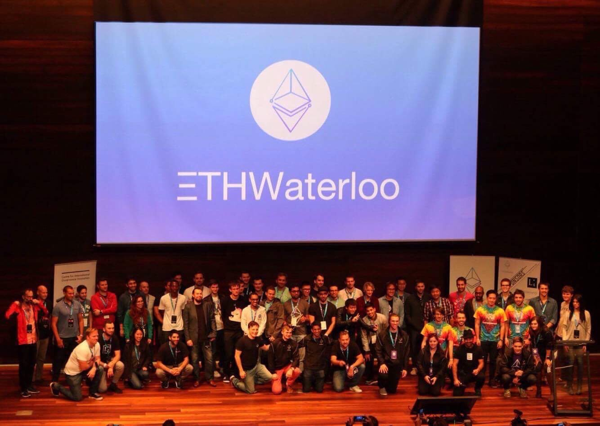
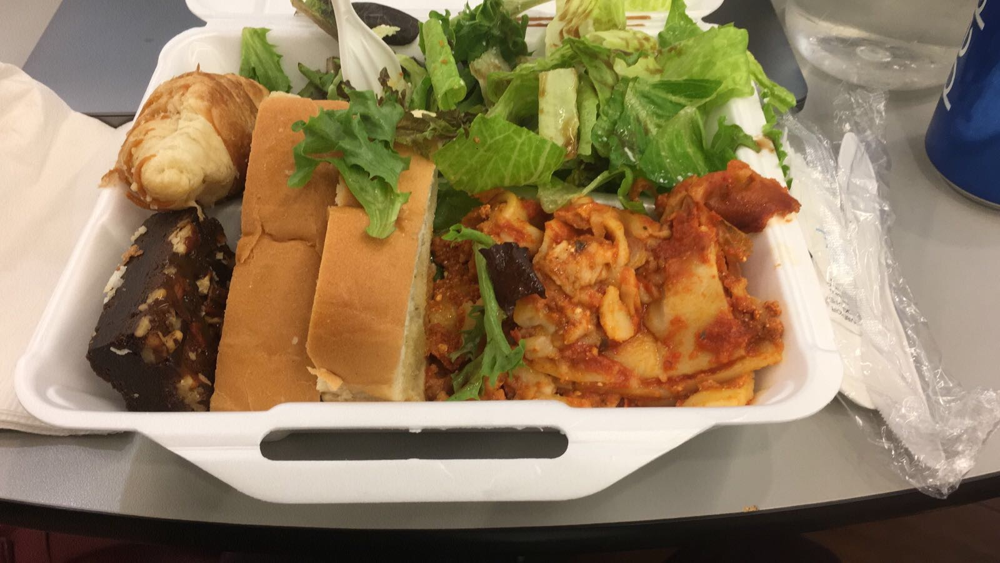
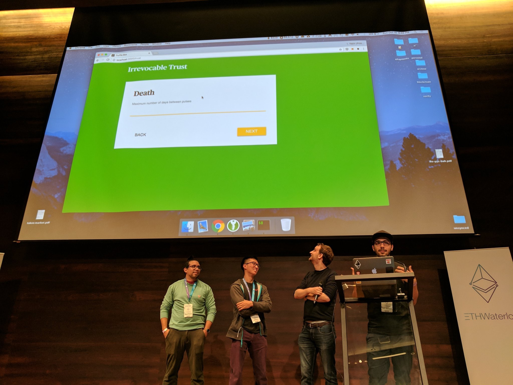
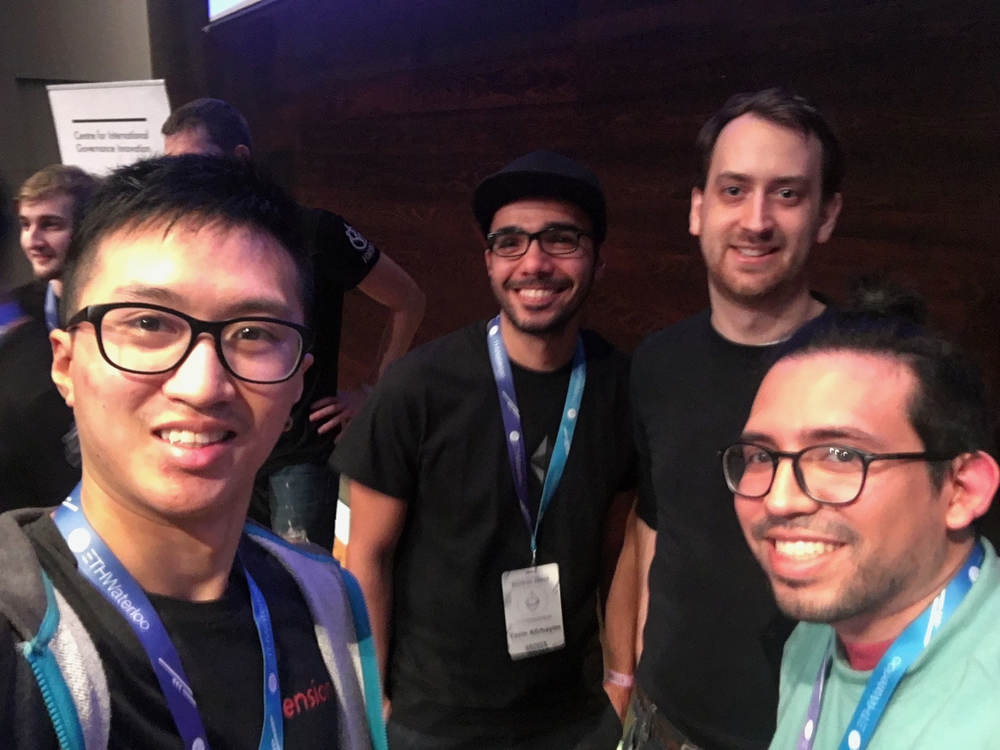

The EthWaterloo hackathon was held in Waterloo, Canada from 13-15 October 2017. 400 people from all over the world came to hack on blockchain based applications for 36 hours, with food, air mattresses and obligatory redbull provided. I booked my ticket to Canada. It would be the first time I would step onto this continent. I didn't realise it would be one of the best moments of 2017 for me. Over 2000 application were made, with only a select 400 getting a place. 20 hours and 12 timezones later, I arrived at Pearson airport at the city of Toronto. From there it was a 2 hour drive to the small university city of Waterloo. 

I got there around 3 days early as I knew I was going to be jetlagged and luckily I have a friend staying in Toronto so I could chill out here. When I got to the venue, I was still jetlagged. I'd never done the full 12 hour flip before. In this condition the battle of Waterloo began in the Canadian autumn of 2017.

I had formed a preliminary team only the night before the hackathon. I had been lazy with it, but luck seemed to be on my side for this part of the event. I met Scott on the facebook group. He had written several ideas for feedback from those attending with one in particular appealed to me. A legal contract builder for 'normies' using a UX-focussed wizard. I liked the idea because the technology is so alien to people right now. It all seems too complicated even to the smartest of my friends. With only a single member in mind for my group, I arrived at the venue.

After waiting for over an hour for the doors to open, I was one of the first people to enter the complex. The large glass windows let the sun shine on my face as I waited patiently in the lobby sofas for my team mates to arrive. My phone flickered on and off as messages were sent back and forth between the two other members of the group I would be meeting. I sent them details on what I looked like; purple jeans, grey hoodie and asian. I left out the weary looking expression of a person dying of jetlag. 

I met the third member of our team a few minutes later. I recognised him, not from his facebook profile picture, but from the fact I was standing next to him for the last 30 minutes not knowing he was actually part of our group. His facebook profile picture disguising his appearance as a caricature in thick black ink. Miguel, was his name. Hailing from Miami, he was to be our designer and UX extraordinaire. With a hackathon win already under his belt, his ability well exceeded his 2.5 years of experience. We talked a little, and I made sure to complain about being jetlagged and ill; most likely making excuses for any future disappointment I might cause the team. A protective habit many of us need to shake. We walked through the complex together, exploring, observing, looking for the best position to setup shop. The large lobby area had hundreds of seats, but most were in direct sunlight. The advantages of getting there early was we could pick the best seats. We turned the corner into one of the private rooms, not knowing if it was off-limits. Seeing other hackers setting up shop already we decided to commandeer a round table in the middle for our base of operations.

The room turned out to be a 'stream' room. A special room with two projectors setup. The auditorium was not big enough to house all the hackers, so stream rooms were set up for us to watch the opening and closing ceremonies. The idea that we would be watching a stream of a presentation that was going on less than 50 metres away is a testament to the advancement of technology today. But the idea saddened me that we can could create such distance whilst being so close.

After around another hour of waiting, Scott arrived from off the bus. We sat down at our round table and began with some small talk before having a chat about our team. It just so happened our skill set for the three of us was perfectly distributed. Miguel would handle the design and CSS, I would build the Javascript front-end and handle the Web3 integration and Scott would handle the back-end in solidity. A perfect trinity. 

Miguel after exchanging a few txts disappeared and reappeared with another hacker he had been talking to prior to the hackathon. Yazin was a charismatic middle eastern man who exuded presence as he talked. He introduced himself as a newcomer to blockchain, but had already done an ICO by himself. A failure in reality, but a success in its proof of concept. He said he planned to do a 'proper' ICO in the next month or two. With introductions done we had to decide what our team was doing before the opening ceremonies begun.

Yazin immediately presented his idea of a subscription contract, that allowed users to authorise subscriptions from vendors who could then 'pull' their allowance after the time had elapsed. I had had this idea around 6 months before the hackathon, so with Yazin's charismatic pitch and it being an idea I already had, I moved to support it. Then it was Scott's turn, who pitched his initial legal contract builder idea. It seemed a little more complicated as none of us were lawyers. However Miguel had already created a legal contract builder (non-blockchain) for his previous company and made some compelling arguments. After the mini pitches, we broke for dinner to digest what we had discussed.

Dinner was served 'school dinners' style with a few volunteers slapping salad and lasagna on our plates. As we ate we further discussed the merits of each idea. The subscription idea seemed to be getting more support, but the only problem was we had heard other teams were also doing it. After looking at the introduction booklet, we knew one of the ideas we were being judged on was originality and it would not have helped at all to have several other teams doing the same thing. So after much deliberation, we settled on the legal smart contract wizard. Yazin would plug the gaps of the team aiming to build the inbrowser compiler and deployer in Javascript. The team was ready.

The idea was to create a simple 'trust' contract that allowed the user to enter a beneficiary to their trust and the condition for release of the funds. With these two conditions the user could then fund their smart contract with their ether and when the condition had been met, the beneficiary could then call the `withdraw` function and receive the funds. It was simple, and with a simple brief setup we could begin fleshing out the front-end. Miguel and I worked for a few hours on how we were going to flow through the user experience, we settled on something similar to Nutmeg.com, which had a nice wizard builder that we could take inspiration from. After setting up the initial foundations, I decided to get some sleep. I was knackered. I was already burning the candles at both ends, and we hadn't even really started.

The sleeping area was a few minutes away from the main hacking area. Ice cream in hand from the complimentary ice cream van on the way out of the venue,  I meandered down there with all my stuff. It felt heavy. So very heavy. Only an ice cream in hand to comfort me on a walk that would normally feel like a blip in the day now felt like a journey. As I arrived, I peered in through the door. Only an elderly security guard could be seen from the front door. When I knocked on the door, he peered through the glass slowly as if not even seeing me. Pausing for a moment, he finally opened the door to my sleepy salvation. The area only had half a dozen weary hackers crashing out. It was early for hackathon standards, but I needed the sleep. I'd make it up tomorrow.

After washing up I found the mattress with the most air, trying my hardest not to rouse my competitors from their temporary slumber. I lay down with sleeping bag over my body. The aircon was blowing into my face and for a while, I couldn't tell if it was minutes or hours, the steps of other competitors looking for a place to rest kept me awake. The plan was to wake up at around 8am, ready to get breakfast, a cool 6.5 hours sleep, but the discomfort of the air mattress roused me at around 6:30am. I had barely slept 5 hours. It would have to be enough.

When I got in, only Yazin was there. He had gotten up even earlier than myself and was plugging away as I sat down in the same spot. Another team had taken over half of our large round table. Unlike the other teams, we had vacated the area instead of saving the table using bags. Big mistake. I began setting up the skeleton for our application. In the next couple of hours Scott and Miguel joined us, Scott the latest, coming in at around 9am. Although he'd make up for it at night.

Throughout the day we would fuel ourselves with an inordinate amount of soda and snacks as well as the obligatory breakfast, lunch and dinner. I tried to eat as much fruit as I could, but by the end of the day even I caved to the temptations and relief that redbull brings to the weary eyes. Miguel and I worked tirelessly together smoothing the UI, whilst Scott and Yazin discussed and developed how to structure the backend smart contract. It was a serendipitous harmony of strangers brought together by the specific conditions of limited time, mutual respect and the atmosphere created by such an event. One could call this the zone, and it is addictive and exhilarating.

At 5pm, I'd only been coding for 9 hours or so. But I could feel myself tiring. I took out my sleeping bag and slept in the corner on a single air mattress, only my earphones blocking out the commotion of the hackathon. Thankfully sleep came quickly and two hours I woke up feeling weary but re-energised. Miguel wished me a good evening, and it snapped me back to reality to continue the fight.

By 9pm we were getting tired. Our movements and thoughts not as sharp as before. The zone is a mesmerising place to be. It feels productive, as addictive as a drug but it takes a toll on you. I was slowing. Every action was taking 4 times as long to complete, like your mind is wading through water. But that wasn't the biggest obstacle we faced. Distractions become impossible to block out and you forget what you were doing only seconds ago. A self imposed dementia.

At 11pm, we had our first casualty. Yazin had got up the earliest and he had been struggling on the bonus application we were creating. A reader for our contract so the user could see how his trust was doing. But it wasn't complying and he decided to retreat for now and continue the struggle in the morning. With Yazin falling, the exhaustion was beginning to kick in. I spent the next few hours trying to put the finishing touches on the contract deployment. But every line of code written felt like an eternity.

I took a break, spending the next hour or so messaging friends and loved ones from back home. She cheered me on from thousands of kilometres away. A feat we couldn't even have dreamed about just a few decades ago. I felt invigorated, renewed. A second wind to push through that final stretch. At 5am, I had finished my part. Miguel was taking a nap in the exact position I was in 12 hours before. Scott the last man standing, defiant and stout, like the last spartan holding the line against the inevitable fatigue. Sleep took us all that night, but not before he completed our submission. We were in the running.

I woke up too early again. This time I didn't waste any time trying to get back to sleep. It was 8:30, still 30 minutes until submissions were final. When I got in, the familiar face of Yazin was already clattering away at his keys, alone on the table. Sitting down and opening up the git log history it was clear Scott had been up late and Miguel had committed work before retiring to a more comfortable place to rest. What a team, it inspired me to continue on. Making some style adjustments I slammed the enter key that pushed my code live. The clock struck 9 and time was up.

When Miguel and Scott got in, we sat down in the judging room prepping our demo. We were second in and the nerves of having to present were kicking in. At the table across from us were a group of revered blockchain celebrities. Joseph Lubin, one of the giants of our niche community, sat there unassuming, but his presence niggled at our nerves with the sting of star strike. The first group bombed, their presentation was sluggish and unprepared. With the 5 minute limit, mistakes were fatal. Rather than making us feel better at having less competition, it put the pressure on. We didn't want to look like that.

It was our turn now. Scott was to do the bulk of the presentation. As he began to talk he turned to me and Miguel, and asked us to introduce what we did. It was impromptu and we hadn't prepared for this. Any stumble now would make a bad impression. Miguel held up to the pressure, rattling off an introduction about User experience and design. It gave me time to prepare my answer, I mumbled something about Javascript, React, Redux and Web3. A concoction of keywords and jargon, hopefully the judges didn't realise how unprepared we were. Scott and Yazin started the demo, it was smooth from there. Yazin demo'd perfectly with a touch of charm and Scott talked more of the future applications of TrustUs, the name I had picked for our team. An easter egg joke only blockchain enthusiasts would understand. We were done and our pride was still intact.

We waited in the lobby after our presentation for a text or an email announcing whether we had got in or not. It was meant to come at 12:30. Every minute past 30 felt like a sting of defeat. By 1pm we felt deflated. It could only mean one thing so we headed towards the auditorium for the closing ceremony to congratulate the winners. I didn't care about winning anyway, I told myself. We got to the doors: "Sorry we're at capacity", said a volunteer guarding the entrance. We walked back to the stream room, where we had spent the last two days. Not once were we able to step into the auditorium. It bit harder now with defeat. We sat down and waited for the ceremony to start, watching the projector screen like a curtain of white, representing our surrender, our defeat; hours wasted for nothing. I heard one of us mumble something about who could have won from our group, it could have been myself speaking, the weight of defeat clouding my mind. I heard myself say, "Maybe the typescript one?". I couldn't remember any of the other projects, I was still exhausted. It would be impossible to recall details from just hours ago. As I tried to think of another team that could have won, I heard Scott say: 
> "We're in the finals".

"What?" I replied. I thought he was joking. I looked up. He wasn't. In a split second: disbelief, doubt, surprise and then elation. A wonderful feeling. We were in the finals.

We stood up. Our feet felt light. The haze of tiredness cleared immediately. We walked on clouds back to the auditorium. Another volunteer stood guard. Again the words came: "Sorry, we're full guys". A smile came across my face, childish and full:

> "We're in the finals"

I couldn't help but take pleasure in the situation, from zero to hero in a few cool minutes. We walked in feeling like a million dollars. The battle was over, and we had won.

