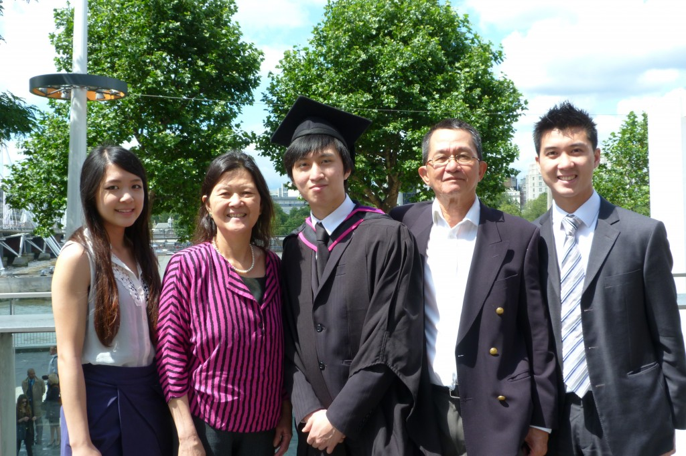

I've been trying to build and launch my personal website for over 6 months now, and most people experience - building your personal site seems to be your last priority when you have other projects going on at the same time. I thought this would be a good first post as I graduated a week ago (to the day). And hopefully if I get a first blog post going and posted to the world, it will force me to complete my website!

I feel like I've grown up a lot in these last couple years and things have kind of fallen into place. I've started two businesses in the last two years, both of them I developed the websites for and I've sent invoices in the double digits for freelance gigs during university, which I never would have dreamed of when I first came to LCC.

Lucky for me I was late to apply for the Cross-college elective in the autumn term of my second year as I applied for a course in 3D design, but it was full. That made me join the Web Design course and we learnt to make a website without any code using Dreamweaver. Now before anyone judges me - I didn't end up building a site using Dreamweaver as I had been reading [Sam's Teach Yourself Web Publishing with HTML and CSS in 1 hour a day](http://www.amazon.co.uk/Sams-Teach-Yourself-Publishing-ebook/dp/B0041G5WBG/ref=sr_1_12?ie=UTF8&qid=1343326067&sr=8-12)