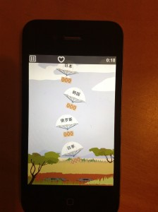
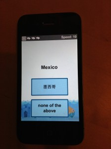
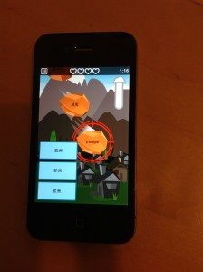

 This review is long overdue as I bought this app almost a year ago after one of my failed Mandarin learning sprints. [Mindsnacks](http://mindsnacks.com/) is a company that creates educational games for learning various things, but their flagship apps are all language based. There are 6 games in each app with about 1500 words in total being tested in a variety of languages, including French, Spanish, Italian and ofcourse Chinese. And these words are spread over 50 levels I was quite excited when I found this on the app store and after playing the first few levels on the free trial, it's one of the only apps that I instantly purchased without much of a second thought. The price was pretty reasonable at £2.99, which must be $5 USD. All I can say for the first week or so I was enraptured by the app. For about 2 weeks, any time I wasn't at university or with friends I was trying to complete challenges and level up. It is extremely addictive at the beginning, because of the gamification side of it and I quickly found myself with quite a decent amount of vocabulary that I could use in a short period of time.

### If you're not trying to be a jack of all trades, you better be doing what you say really well

Here's the first pitfall though. Learning a language isn't just about vocabulary. Because I'm not a complete beginner at Mandarin, I was able to use the vocabulary in a meaningful way, but if you are a complete beginner, Mindsnacks does to give you sentence examples or any context to what you're learning. So you'll have to learn the grammar elsewhere (I did recently read that there is an informational panel that teaches you basic grammar for certain more difficult words, but it's something few and far between). I would usually say that that's fine, as not every tool can do everything, but if it doesn't teach you context and grammar it needs to be extremely good at the specific thing it's teaching you - and that's vocabulary. First of all, the Mindsnacks app does not teach you to write any Chinese characters. This is mostly fine in every other language as if you can read and recognise the word, it's not too much more of a stretch (latin based languages) to be able to spell them and write them. In fact one of the games actually helps you to learn to spell words from the sound when you're learning French, Spanish etc.. But for Mandarin you're less fortunate as this spelling game is useless, and they've replaced it with a tones based game.

This is actually a great game for teaching you tones, but the game it replaced (the spelling game) actually taught you how to spell words and basically write or type them. So actually there is another game needed to teach writing. Some Mandarin learners actually advocate learning Chinese without the characters for a while or even til fluency, but I think it's a very difficult task as the characters actually help you to remember words and it's only for the really dedicated. And if you're really dedicated, you might as well learn the characters as well (This is from experience of learning Chinese for many years without much success and without trying to learn 汉字). And even those that do advocate this, still think reading is an integral part of learning Chinese as you won't get too far in China if you can't read a menu or read street/road signs.

### Ridiculously easy or hard reading game

This leads me nicely onto their reading game. Their reading game is pretty damn bad if I'm completely honest. I've seen the same game in French and it is clearly built for an alphabetical based language. The game is basically to catch misspelt words and therefore you must know how it is spelt correctly and be able to read the word. This game in French is pretty easy, and might actually teach you to read and know how to spell the words correctly eventually, but in Chinese the game is either **ridiculously easy** or **ridiculously hard**. I'm exaggerating this either, there's just not any middle ground at all. You either know the character or you don't. If you recognise a character and you would know it if you saw it on a sign or in a text message - that's not good enough as the game is built to create characters that are _vaguely _similar but not quite the same. So you'll find yourself wanting to top yourself as the Rhinoceros (don't ask) blow up when you think it's the wrong character but that dot you thought was there is actually not in the real character! If you know the characters then the game is a piece of p**s and you end up completing the current level very quickly by racking up tons and tons of points. Which actually brings me onto how the level system works. So each level has about 30 words in each and each level has 10000 points you need to accumulate before you can advance to the next level. These points are distributed among each word and become 'mastery points' in essence and as you play the games, each word is 'mastered' and will not appear as much as the words you haven't learnt. The problem with this system is that you can master any word with ANY game, which means that you could play one of the games over and over until you've mastered all the words and you can advance to the next level. This is a big big problem as you may know how to read the word, but you may not have any idea what that word means at all. This isn't the only problem either, because the mastery system is only positive and never negative. Apps like Skritter that help you learn lots and lots of vocabulary using a flash card and spaced repetition system use a percentage system that means if you forget a word, you'll see the word more often. Mindsnacks Mandarin has no such functionality, which means if you did an intense period of learning in a short space of time, of course you'll remember the words then when you've seen them dozens of times. But in a few days you'll have forgotten them, but Mindsnacks thinks you've 'mastered' them. The app also doesn't make it that easy to review your words, it's rather clunky how you do it and doesn't let you for instance flag certain words you know you don't know and put them together with words in other levels you don't know and review them together; you have to do it level by level.

### It's not all bad, they have the right idea

I've complained quite a lot about it so far, but I honestly do believe that Mindsnacks do have a great piece of software and that it _could _ be an incredible app for learning Mandarin, but it's not yet. I think with a better piece of spaced repetition software that tracks the progress of individual words better it will enhance the learning experience in an orders of magnitude. What it does do right is how they are approaching learning a language. It doesn't have to be a boring experience, it can be fun and it can be gamified so there is some incentive apart from fluency. The other games I didn't talk about are actually pretty good, there's one where you are in a fish tank and you have to answer before the water reaches the bottom. It's multiple choice and you are against the clock and it gets faster and faster until you have literally milliseconds to react or you lose. This is a great game for improving fluency as you must instantly recall certain words, but I did find after a while I was using certain characters as 'anchors' for my memory and not actually recognising the other characters because I didn't know the words that well. And next time I need to read that word I'll recognise that one character I used as an anchor for my memory, but the other characters - yup you can forget about them. There's no audio feedback either so you'd have to manually go and find that character in the review section to read it or use one of the other games. There's one that is very much like Rosetta Stone type games, audio to picture recognition. This is a good listening game in theory, but it gets very easy very quickly as you begin to anchor certain parts of the words with a picture and some of the pictures don't represent the words at all so they actually have the English translation, which makes it even easier. My favourite game is one of the games you have to unlock which is a meteor game, much like the fish tank game, but it gives audio feedback on the word you picked and it's much better for learning new words.

### Could be a real contender if they add in SRS, a reading game and improve the gamification/progress aspect

Overall I feel it isn't going to be a big part of your toolbox for any serious Mandarin learner. It might be better for the European languages and other alphabetical languages, but for Mandarin it needs some work. If they create a game that can teach you to write (similar to Skritter), and something better for reading as well as integrating a better progress system for words and spaced repetition (they seem to do it a little, but nothing major to even notice) then it could be a serious contender. On top of that if it was extendable to add your own flash cards and vocabulary - that would be on a totally different level and would create some serious competition to the market leaders in Mandarin learning software. Linear learning seems to be a thing of the past now, especially for self study students - flexibility and extendability is now super important to the modern language learner. I will continue to use the app for fun as I still remember those 2 weeks where I couldn't put the app down, but until they make those changes, it will never be a main language learning tool for me.