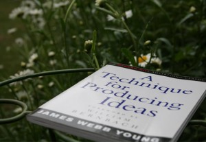

I just spent part of my day earlier this week helping my friend with his application for his dream to be a pilot. He's spent the last few months trying to write it and we pretty much wrote it all in half an hour. The problem with writing is that it's creative. Things need to be flowing and anyone that does anything vaguely creative knows that it's all too easy to hit a block.

 

What I found my friend was having problems with was not a lack of passion or laziness (well maybe a little). But it was related two reasons that I've encountered many times over the years whilst designing and programming. Firstly he had too much information and in turn secondly a lack of focus. With anything creative whether it being design, writing or art there's a main point you want to express or achieve and everything else is built upon that. So the first thing you need to do is - figure out what your goal is.

The first question we answered was 'why do you want to join this airline'. You have to think about what kind of information they are trying to obtain from asking this type of question. So I translated it to 'what kind of employee do we want at this airline'. And then it became simple: passionate, hardworking, dedicated and loyal (skilful would be one too but it's a cadet program). Then we needed to extract a main point personal to my friend to use as the basis for his answer. That was also simple. It started off as 'I want to be the best pilot', and then linking it to the airline: 'I want to be at this airline, because it's the best in Asia and I can become the best pilot I can be'.

Once we had our main point we extracted reasons why my friend wants to join this airline: training, travelling, based in Hong Kong, the best airline in Asia. And from there it was super easy, we just expanded each point, made it personal to him and linked them all back to our main point.

 The book that inspired this post

Now the reason I am recalling this is not to teach you about critical or creative writing, but to explain what creates creative block. A book I've read about this is called 'A technique for producing ideas' by James Young. It discusses the 5 stages of creating an idea, which are:

1.  Gathering raw materials
2.  Digest the Material
3.  Unconscious processing
4.  The A-ha moment
5.  Idea meets reality
This book was written over 50 years ago, but it's as important then as it is today and I'd highly recommend reading it, even if you're not a creative - everyone needs to generate ideas in anything you do. I applied this simple cycle to my friend's problem and we manage to cut through his creative block super quickly. He already had the raw materials and had digested it, we just did a bit of quick unconscious processing and came up with multiple a-ha moments to build his answer.

The problem I think some people have is that they sit on their digested materials for too long. At some point you just need to start working and then it will start to come together. If it doesn't work you start again. No one writes a perfect book first time, it starts as a draft and then another draft and then another draft. You to get something down on paper, and then keep on editing until you get things right. For me it's about the speed you implement things. When you think of a possible solution for a problem, you should just go and do it. Fast implementation. Don't sit on things too long, because it becomes harder the longer you wait.