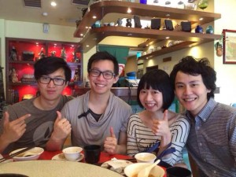

I've been staying at my host family's house for a day now and I just a super long conversation with them about the religion they practise, Nichiren Buddhism. I've always found Buddhism interesting in particular because it advocates self improvement and enlightenment over things like forgiveness or abstain from particular life activities. The latter doesn't make sense to me as I believe everyone has the right to their own choices and therefore is wrong or right, there are just consequences.

What they taught me about Buddhism was there are 10 levels. All the way from murderers (10) to animals who have no rationale (7) to humans (6) to Buddha (1). Where you are in this spectrum depends on what has happened in your past life and the decisions you make in this life. And every decision you make on this earth can be categorised into one of the 3000 different emotions, which in turn are one of these 10 levels.

They explained this to me as cause and effect. This conversation was entirely in Chinese so it was 因 (yin1 - cause) and 果 (guo3 - effect). Every decision we make is the cause and it all has an effect. And these keep building and up and weave together. For instance me meeting this family here and having this conversation with them. I had to decide to come to Taiwan with my Singaporean friend, decide to wake up early enough after I'd be drinking the day before to go to lunch with them, then had to be friends with them so they felt comfortable enough to host me and today I had to come back early enough to start this long conversation. There are definitely even more things that would be in between this, but you get the idea of cause and effect create a web of decisions that ultimately determine your fate.

After they explained their religion I explained my love for learning that grew out of learning Mandarin. My original reason for learning Mandarin was because I felt I didn't fit in and that changed into many other reasons along the way such as wanting to communicate with people in Shanghai and because I wanted to learn how to learn. These reasons constantly changed, but the thing that stayed constant was my urge to learn and learning how to learn the fastest, most efficient way.

After I explained this they all felt it was similar to the way they practise buddhism. In Nichiren Buddhism, they chant twice a day, once in the morning and once in the evening. This habit they form helps them to find enlightenment or what I believe is trying to figure out what's their purpose or goal and what they've done wrong (which is what they can improve). These constantly change, which means you need to keep the habit going constantly. Similar to language learning your learning requirements change constantly and what motivated me to learn Chinese before may not be the same reasons I learn Chinese now. They always change (一直装一直装) and you need to keep being self critical to find your new reasons and motivations to learn as well as what mistakes you're making so you can plan your life and what you're trying to learning accordingly. There's no point in reading a book that you understand completely.

For buddhism, the learning never stops. It doesn't with a language either.

&nbsp;