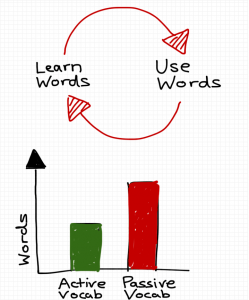

_Note: This applies mostly to intermediate language learners and above. As a beginner I believe your passive vocabulary should be your active vocabulary as you grasp the fundamentals of the language._

I recently met a language learner in Taiwan called [Olle](http://www.hackingchinese.com). He's been blogging and learning Chinese for several years and we had a conversation about our learning Chinese experiences. It reminded me of the language concept that I always preach to other languages learners or those interested in my story. Except the way that Olle described it was from a slightly different perspective and made me realise I need to practise what I preach and get back on the bandwagon.

[caption id="attachment_340" align="alignleft" width="249"] My diagram above and Olle's below[/caption]

As you can see from diagram. I pictured it as as circle. You learn words by flash cards, watching TV, listening to podcasts - whatever way you prefer. Then you use those words, which involves practising your language with natives. The problem with this diagram is that it's not quantifiable. And it kind of implies any words you learn you should use. However a more realistic and helpful way to look at it is that you're going to learn more words than you can use. Passive vocabulary will always be greater than Active.

The way Olle described it actually much better illustrates what you know and what you need to do - albeit still abstract. His is more like a graph of how many words you know, one measurement is your passive vocabulary and the other is your active vocabulary.

Your passive vocabulary is words you know, but can't use and active vocabulary is words you can and do use. Therefore if you put it more simply, passive vocabulary is what your understand and active is what you understand and are fluent or familiar enough with to use. Both diagrams illustrate the main problem that language learners encounter at all levels.

The two main problems, illustrated by the graph is the ratio of active to passive vocabulary. Olle for instance told me when he first started he concentrated solely on increasing his passive vocabulary until it was a factor of 10 or more higher than his active vocabulary, so when he came to Taiwan all he needed to do was to practise what he knew and he could see progress. So the problem he would have had there is that he just needed to stop learning vocabulary for a while and use that time to practise what he knew. The other problem you can probably guess is when your active vocabulary is the same as your passive vocabulary, so the only thing you are improving is your fluency (which isn't always a bad thing). This will mean you are progressing quite slowly as you will only acquire new words through conversation (such as the odd word you don't know and you ask a native). However to natives, this might seem like you are actually improving a lot as the more fluent you are in what you know, the more native you sound. And I feel this is what native speakers actually judge your level with. Daniel, a Portuguese and Spanish learner talks about 'discourse markers' such as 'uh, erm, like' in English [here ](https://www.youtube.com/watch?v=Fncd-dTNIv4)

For me I've been pretty lazy about improving my passive vocabulary since I started travelling and I've hit a wall where I feel I'm not improving. But that improvement is actually coming with improved fluency, which is hard to see at an intermediate level (and even harder to see at Olle's level!). For me though I can feel I can express most of what I want to see, but in a very roundabout way. So after this wake up call I'm going to more actively increase my passive vocabulary again through podcasts, TV shows and reading material. Hopefully after my passive vocabulary improves I begin to improve my fluency and my active vocabulary at the same time and be on my way to 高级中文 (Advanced Chinese)!