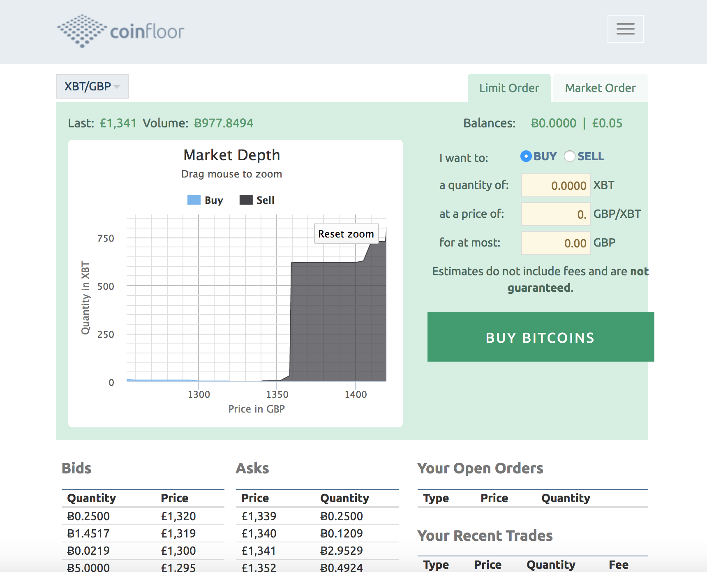
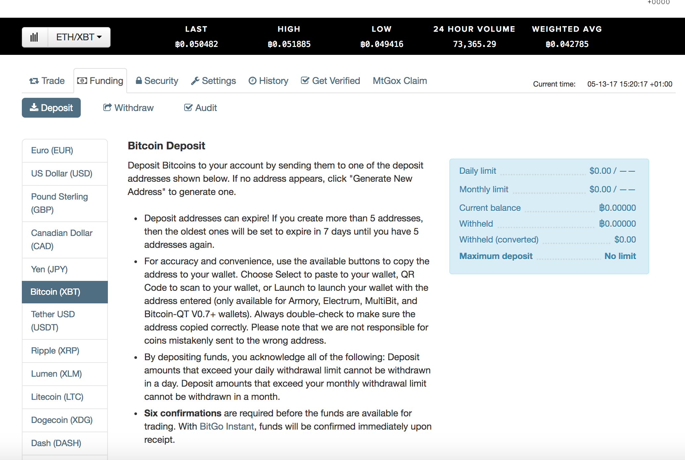
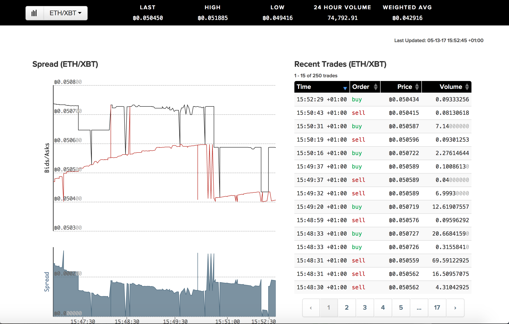
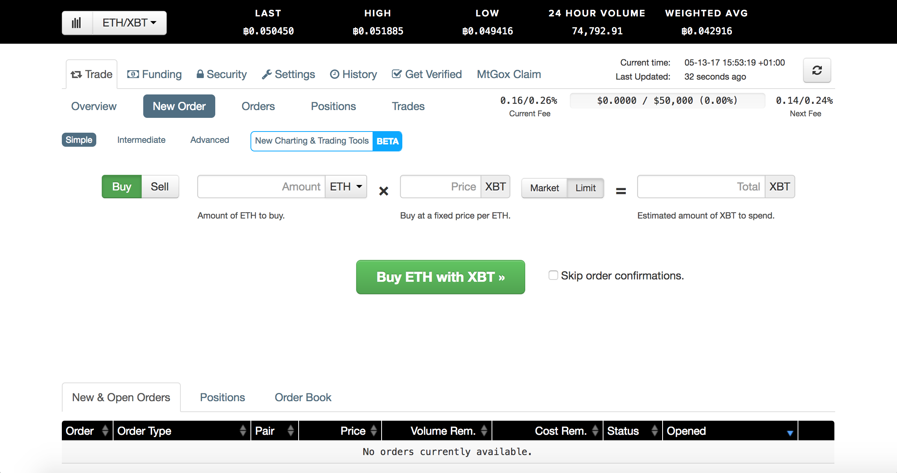

Buying Ether in the UK is a little difficult. There are a few exchanges that do let you deposit GBP, but because they aren't based in the UK, their volumes are low, which means its hard to get a good price if you aren't just buying a few hundred pounds worth. The easiest, fastest and most reliable way to do it is by using a combination of two exchanges. One with high volume GBP/BTC (Pound to Bitcoin) and then using a high volume BTC/ETH exchange. My personal favourites are [Coinfloor](http://coinfloor.com/) and [Kraken](https://www.kraken.com/).

###Get verified 
First step is to get verified on Coinfloor. You won't be able to deposit any of your GBP onto the exchange without first getting verified. This step will probably take the longest and requires you to photocopy proof of address as well as identification. If you are buying a very large amount you should also get verified on Kraken to the rough amount you will need to deposit. When depositing cryptocurrencies and not fiat, you don't need to verify nearly as much information than if you were depositing GBP so you might be able to skip this step

###Deposit GBP
Make the international transfer from your bank to the Coinfloor bank account. This could take anywhere from an hour to a few business days. I've had varied 

###Buy Bitcoin with your GBP

Make a limit or market order on Coinfloor and buy Bitcoin. Do **NOT** use the OTC/Express Buy option, it'll cost you more money and defeats the point in using multiple exchanges

###Transfer your Bitcoin to Kraken
Go to Kraken and go to Funding => Deposit => Bitcoin (XBT). In here generate a new Bitcoin Address and **copy** (do not do this manually) this address over to Coinfloor's withdrawal address

###Buy Ether with Bitcoin

First you can hit the chart button and see the recent trades and if you scroll down you can also see what the bids and asks are. If you don't know what that is, you can look it up on investopedia. It is a non-crypto specific term for markets. This is only important if you are placing a limit order. If you want to keep things simple you can just make a market order.

In this next screen you can see the order screen where you can place your order to buy ETH. If this is your first order I'd just keep things simple and make a market order, which will just pay the market price for ETH. You don't need to worry too much about small fluctations in price

###Withdraw your Ether

The last step is to withdraw your Ether. You can keep your Ether on the exchange if you only bought a small amount, but you are risking the exchange itself being hacked so therefore most people will advise to transfer your Ether out into a wallet. The most common wallets are [Mist](https://github.com/ethereum/mist/releases) and [MyEtherWallet](https://myetherwallet.com/). Discussing how to store your Ether requires an entire post on its own as there are many wallet solutions, from software, hardware and even paper based wallets. If you're just getting your feet wet, make sure you read up on each of these and their differences so you're staying safe with crypto that might be worth 10 or even 100x in the future!

*Note on buying Ether in other countries: The same steps will apply, however you will just replace Coinfloor with another exchange, preferably the highest volume YOUR_CURRENCY to Bitcoin exchange there is and then use Kraken or Poloniex (high volume ETH/BTC exchanges)*

