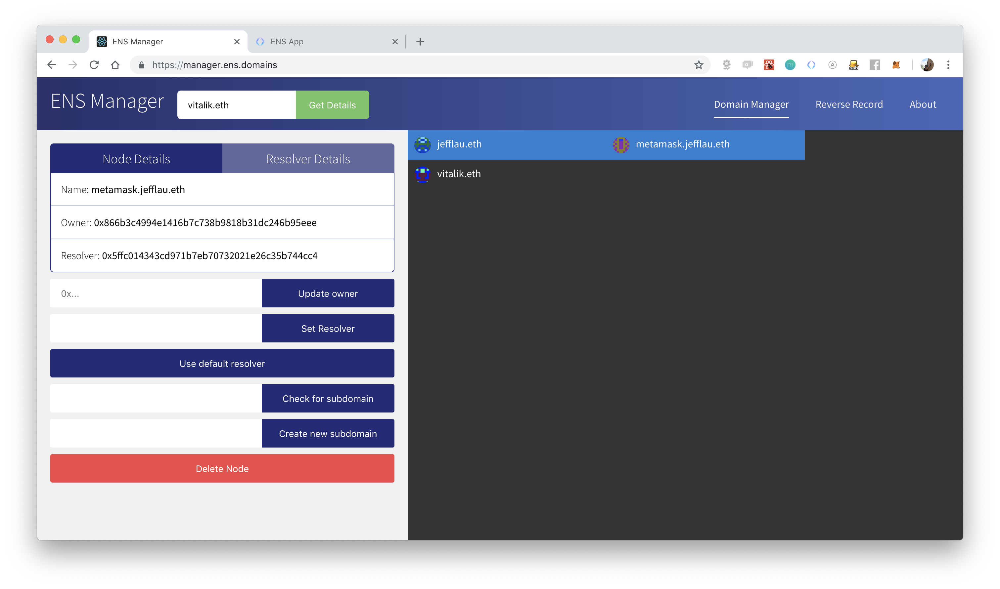
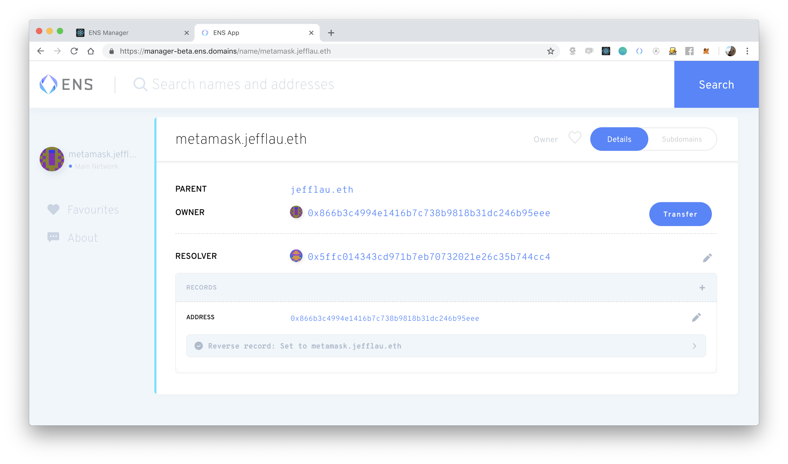

I started working on ENS in June 2017. It was just a small project I managed to pick up off of Ethlance. Through a little bit of friendly nepotism, namely, my friend (and now co-founder) Makoto already knew Nick from ENS and managed get me hired to do the first iteration of the ENS app. It was quick, it was simple and it worked. And it looked like this:

The last few months I've been working with a team on the newest redesign on the app. It's finally at feature parity with the original manager albeit with a much intuitive interface.

The first thing we were working on when building the new manager app was the correct UX for users so they wouldn't be confused. The original manager although functionality had no real indication of how to use it. The original manager split the details between the node and the resolver, but it wasn't really necessary to make this distinction in the UI even though it is like that in the contracts.

We also split the subdomains into a tab so they didn't distract for the overall new of this specific name. Normally when you are looking at a name you aren't actually that interested in what subdomains are part of this particular name, and therefore they are now hidden behind a tab and allow the user not to be distracted by unimportant information.

The edit buttons and functionality are now much smaller and are hidden until the user actually wants to use them
