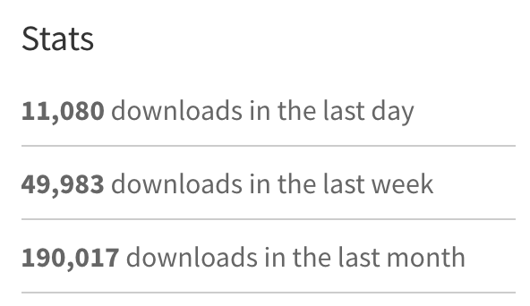

Spent the last two days catching up on some open source work. I have one project to be exact (that anyone actually uses) and I made it in August 2016, which is over 1.5 years ago. Since then it has reached a peak this month of 190k downloads per month. It's a Javascript library called [jest-fetch-mock](https://www.npmjs.com/package/jest-fetch-mock).

At the beginning I didn't even know how to make a public npm package, although I had written `npm init` many times before, I'd never published something where someone else would write `npm install [my package]`! When I first wrote this package, it was because I was talking to one of the sole (and I think part-time) maintainers of Jest, Christoph [(@cpojer)](https://twitter.com/cpojer) about how to mock fetch requests in Jest. No one was really using Jest at the time, and there weren't that many packages around, so Christoph convinced me to write an npm package so everyone could benefit from fetch mocks in Jest! From there, Jest has got more and more traction and without any marketing, blog posts or even tweeting, it has gained more users than I could even imagine!

So without further ado, I'd like to share what I've learnt over the last year and a half of maintaining a small, but popular open source project!

## Make it and people will come

If you make something useful, even if the code is bad, even it's untested, people will use it. I was just writing code that scratched my own itch, but in the last year and a half over 20 other people have helped contribute to make the project better, cleaner and more usable. At times I've felt overwhelmed by the amount of people using it. I've had 35 issues (5 still open) and 22 pull requests. That's 57 meaningful interactions with my repository, almost one a week, or one every 10 days. But in the end it was satisfying to know I was making something that other developers were using. There is a sense of pride, that is different from having non-coders use your applications. If you don't do a good enough job, they could fork your code and make a better version!

## You don't need to be an expert to write a package

I didn't know anything about writing a package when I first started. I learnt everything from how to publish to npm, to how to handle contributors. I learnt how to put in a license, how to write documentation. It's similar to the trial by fire I had from taking my first freelance gig almost 8 years ago. When people are depending on you, you learn quicker than you've ever learnt before. If you want to start, you can, you just need to do it now and you'll learn along the way. It can be intimidating putting yourself out there, to be open to critique from your peers. But ultimately it makes us better, strong people. Which segue nicely into my next point.

## It makes you a better coder

Coding a library that someone else is going to use makes you think about code in a different way. You're writing a toolbox, not a product. It can be used in more ways you can imagine, so thinking about writing a library allows you think about code from a different perspective. You think very carefully about your implementation - shall I have 3 parameters here, or one as an object? What should I return from this function? What types am I returning from this function? Is this part of the API useful or is it adding bloat? Although the library itself isn't very long, the fact that I've spent a year and a half of my spare time maintaining it, it has changed my perspective on code. That's something you can't really learn any other way. You learn to care about things you just don't care about when you're writing one-off code that you "promise you're writing for the _next_ developer that is going to maintain it", but really - you don't.

## Giving back is important

There's probably thousands of developers that use open source software to each person that actually writes meaningful contributions to the open source community. You can do it as much or as little as you want, but even a few hours a month is enough to maintain a stable open source project, or make pull requests on existing projects. And even if you don't enjoy it as much as others, it _will_ make you a better developer.
