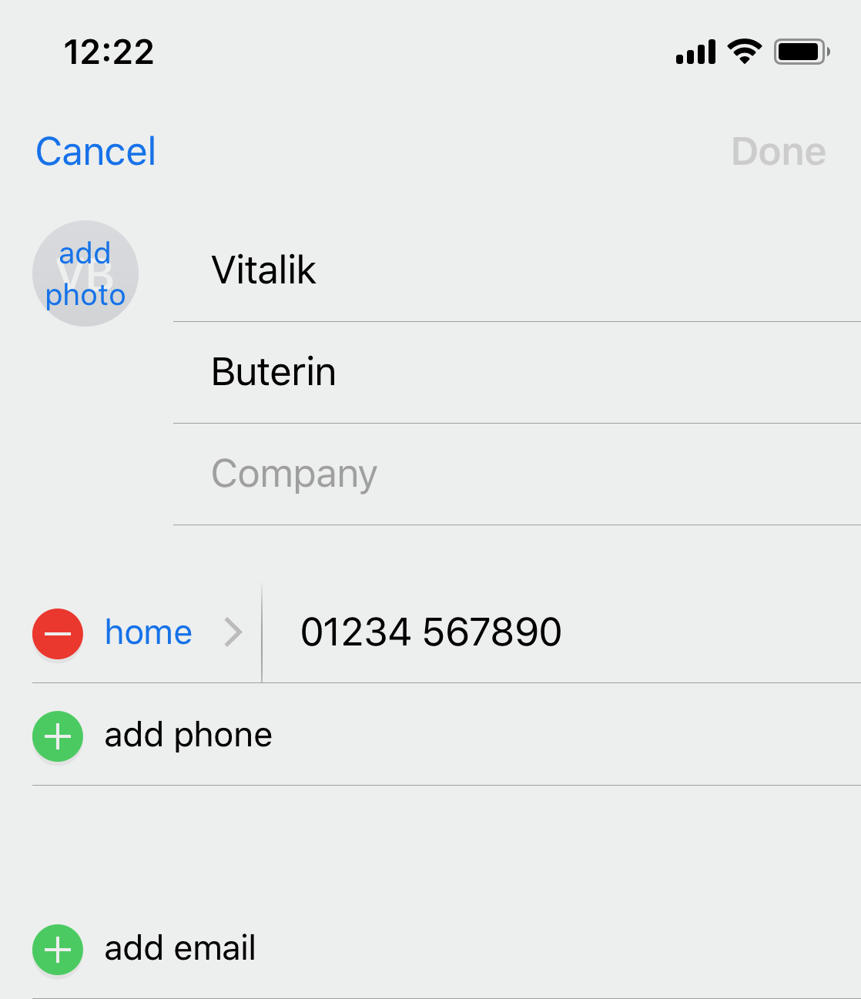

ENS is a decentralised naming system. I like to compare it to a global decentralised phone book where most of the time you want to associate your phone number with a name that is easily remembered and recognised. But in your phone book on your phone you can also add in other records other than a phone number such as email, a website, a picture or more.



With a phone book, you have multiple records for different phone numbers. You can also have other information such as email address or URL. ENS works in a similar way. There is a main address that your name resolves to, but you can also add other information just like a phone book record.

With this we can just remember someone's ENS name and we don't have to remember hexadecimal strings for their Ethereum address, contracts or IPFS hashes.

##How to get your name?

The easiest way is through [http://now.ens.domains](now.ens.domains), which is a subdomain registrar. Domain owners have put their domains up for subdomain registration and there many that are free to register.

The most flexible way is through the vickrey auction (registrar.ens.domains), which allows you to get a top level domain such as `vitalik.eth` is good if you want to setup usernames similar to email addreses.

There is also a way to get a gitcoin subdomain such as `vitalik.gitcoin.eth` if you have a github account. They put through the 3 transactions of registering a subdomain, setting a resolver and setting the address for your resolver so you don't have to. They also pay for the gas so it's all free! As of this post they have yet to allow owner transfership though, so even though the name will point to the address you decide, it could technically be taken out from under you. Although unlikely, it is important to be aware of the risks.

[https://gitcoin.co/ens/](https://gitcoin.co/ens/)

##Forward resolution - Basic usage

`Name => Address`

The most basic usage is to map a name to an address. In practice, this is done through one level of indirection: the resolver. You look up your name in the registry, check which resolver it points to and then you call the resolver and find the address the name is pointed to.

A simple example of this is that `resolver.eth` resolves to the contract address to the public resolver. We use this in the manager dapp code to avoid hardcoding the resolver and if we ever update the public resolver, we can just point ‘resolver.eth’ to the new contract and our dapp doesn’t need to update anything.

```js
import { providers } from 'ethers'
const provider = providers.getDefaultProvider()

provider.resolveName('resolver.eth').then(address => {
  console.log(address)
  // '0x5ffc014343cd971b7eb70732021e26c35b744cc4'
})
```

This is how you would get the public resolver address using `ethersjs` V3, which has built-in integration to ENS.

##What is a resolver and why do we have it?

ENS names can resolve to a lot more than just addresses. Some people think that ENS is just a mapping between ENS name and Ethereum address, but that really is only one usage of it. If you think of the ENS name as the name of a restaurant. Then you can go through the phone book and find the number of that restaurant.


Once you are on the phone to the restaurant, you can ask them for an opening time, or you can ask them if they have a table free, or you can ask them if they have any job openings. 90% of people are probably going to ask for the opening time or for a table, but some people are going to need other information. This is why the resolver exists. If we hardcoded the mapping between ENS and address, you couldn't add any other records. If we hardcoded a set of records, again if we needed any new records in the future it would be impossible to add. So in the ENS registry, a name actually maps to a resolver, and it is this resolver that you can query records such as the address.

If you wanted more advanced records you could create your own resolver. And the resolver can be replaced with a newer version at any time.

The public resolver already can resolve a lot of things. But the most important things you may want to use as a basic user is:

* an Ethereum address or contract
* a content hash (IPFS or Swarm)
* ENS Name (for reverse resolution)
* Arbitrary text as a key-value mapping
* JSON interfaces for your smart contracts (ABIs)

## Reverse resolution

`Address => Name`


You can think of reverse resolution like caller id. It allows you to take something that is non-human readable (a phone number) and turn it into something you can recongise (a name). The same is true for ENS's reverse resolution, it allows you to turn an address into an ENS Name.

This is great for dapps so they can show human-readable names to your own addresses that have reverse resolution setup. Eventually one day if everyone is using ENS names, we can get rid of the reverse resolver, however today this is a great way to get the benefit of ENS today.

ENS has a “reverse registrar” where you ‘claim’ your Ethereum address. It functions in the same way your `vitalik.eth` name works. Once you own your address (only the address owner can claim it) then you just need to set it up with the public resolver and add a `name` record to it. The public resolver has support for this so you don't need to look for a 'reverse public resolver' - they are the same!

```js
import { providers } from 'ethers'
const provider = providers.getDefaultProvider()

provider
  .lookUpAddress('0xfdb33f8ac7ce72d7d4795dd8610e323b4c122fbb')
  .then(name => {
    console.log(name)
    // 'arachnid.eth'
  })
```

This is how you would get Nick Johnson's (the ENS lead developer) ENS name using `ethersjs` V3. Once you have their name, you can decide to show it alongside their Ethereum address or just show their name. You just need to remember to resolve their name to their address if you're using it as an input to a transaction! Hopefully in the future contracts will also support ens names and resolve for you on chain, but for now we can show the names and resolve them first before using them. This way the user is none the wiser that an Ethereum address is actually being used behind the scenes.

## Subdomains

As a domain holder, you also have the right to create arbitrary subdomains. These are as powerful as top level domains and all have the same functionality. You can decide to just keep your account the owner of your domain, or you could put a registrar on it to allow more fine-grained control over your subdomains. The most manual way would be to just create all the subdomains manually. This would be good enough if you were creating subdomains for all your company members, or for your family members, or for each smart contract in your application.

However you can also setup a First-in-first-server registrar (FIFS) to allow anyone to register domains. This would be good if you wanted to allow people to create usernames for your dapp.
Subdomain ideas:

* Setup a FIFS registrar to register usernames for your dapp e.g. jefflau.aragonid.eth
* Versioning for your contracts v1.aragonapps.eth

There is a super basic example of this kind of registrar at the ENS github: [https://github.com/ensdomains/ens/blob/master/contracts/FIFSRegistrar.sol](https://github.com/ensdomains/ens/blob/master/contracts/FIFSRegistrar.sol)

```solidity
function register(bytes32 label, address owner) public only_owner(label) {
        ens.setSubnodeOwner(rootNode, label, owner);
    }
```

You can see from this solidity code how the first-in-first-server registrar registers a subdomain. It just sets a subNodeOwner for your 'rootNode' (e.g. vitalik.eth) and you just need to add a label and an owner and it will automatically create a new subDomain for you.

ENS is constantly evolving. We want to create more standards around records in resolvers so they can be used for more than just addresses. However if we only achieve the aim of turning all Ethereum addresses into human readable names, that will be enough of a difference to make Ethereum much more user friendly. If you use this for your wallet or for your dapp, you will be helping us take that step towards blockchain usability.
