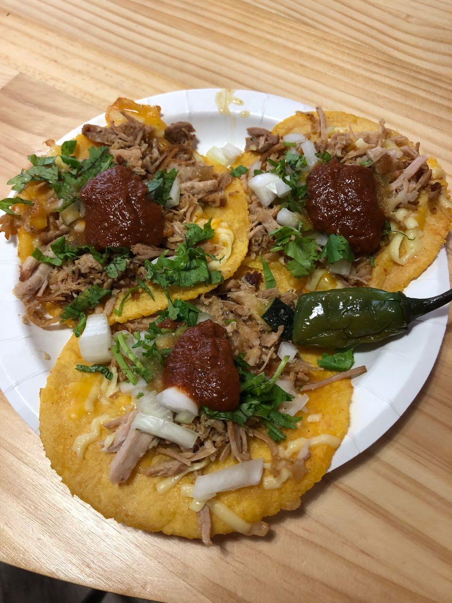

I've been working remotely for almost 6 years now and I have been an avid cafe goer for most of that time. There was an excitement to going to a different place every day/week/month. However the last couple of years I've spent most of my time working from home, mainly because I was lazy to leave the house and it's tiring to fight for a seat in my favourite cafe. I like working in my underwear and the freedom of my own home office, but I did feel there was something missing.

Last year I bought a coworking pass for the first time. It was a WeWork pass and I spent about 2 months working from there. Although the space itself was beautiful, there was a coldness to wework. The one I went to in Towerhill is mainly offices, with a sprinkling of dedicated desks and a small amount of hotdesks. I barely saw the same people twice as I only had a hotdesk, but the beautiful balconies and free beer were enough to keep me going back for those 2 months.

Since I've moved back to Taipei, I've bought a membership to [the hive]() for about 5 months now and I'm loving it. I like having a place to go to everyday, a place to call my 'home office'. I don't have to fight for seats like in the cafe. I'm not super social these days, but even without going to a single social event, I've made some steady coworking friends that I can grab lunch with occasionally or have a chat with in my break. I've been on a hotdesk during this time, but I'm considering upgrading to a dedicated desk, where I can enjoy the benefits of hotdesking when I need to work somewhere else, but go back to my spot when I need to zone in for a while.

On top of that, I've made use of the Hive's international presence, where I can use my membership card in countries all over asia. I've personally used in Hong Kong, where the membership is actually significantly more expensive than in Taiwan, but since I have a full-time membership, I get to enjoy 24/7 access to their facilities as well. It's a nice touch and I'm beginning to buy into the coworking lifestyle. I feel the productivity bonus of working outside the house, without the unsteadiness of a space, wifi or noisy neighbours at a cafe.
